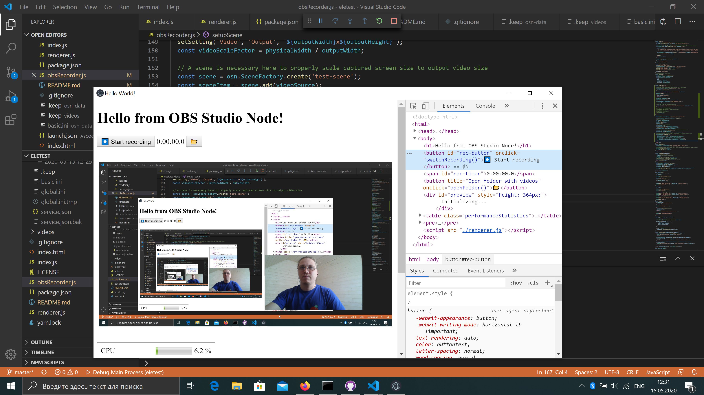

# Very simple example of [obs-studio-node] usage

Out of the box it works only on Windows. For running it on MacOS see below: [Run on MacOS](#run-on-macos).

## Setup

```
yarn install
```

## Run

```
yarn start
```

or use `F5` in Visual Studio Code.

## Package

```
yarn dist
```

You find the generated installer in the dist folder.

## Current state

 It launches, initializes OBS Studio and lets you press "Start recording" button. On recording it captures your desktop video, your webcam picture (if available), audio, and microphone to the video file in `Videos` folder in your user profile directory. Look at main process' console output.



See [this topic](https://obsproject.com/forum/threads/laptop-black-screen-when-capturing-read-here-first.5965/) on how to solve black screen on laptops with two video cards.

## Code of interest

Most of the interesting things are located in [`obsRecorder.js`](./obsRecorder.js). Some snippets are taken verbatim from [obs-studio-node] tests and [streamlabs-obs] source code, but some are results of experiments.

## Run on MacOS

Change link to [obs-studio-node] in your `package.json` to include version of package built for MacOS:

```
 "obs-studio-node": "https://s3-us-west-2.amazonaws.com/obsstudionodes3.streamlabs.com/osn-0.9.5-release-osx.tar.gz",
 "node-window-rendering": "https://slobs-node-window-rendering.s3-us-west-2.amazonaws.com/node-window-rendering-1.0.12-osx.tar.gz"
```

To get the latest url, clone [streamlabs-obs](https://github.com/stream-labs/streamlabs-obs), run `yarn install` and copy it from the output.

Execute `yarn`:

```sh
yarn install
```

Start the app from a native terminal, not an integrated terminal like VSCode's.

`node-window-rendering` is used to support preview for MacOS.

There are some known issues with MacOS: 

- obs64 process doesn't shutdown on app quit ([#22](https://github.com/Envek/obs-studio-node-example/issues/22))
- errors in log files ([#18](https://github.com/Envek/obs-studio-node-example/issues/18))

If you can help with those, please fix them and open a pull request!

## Use with your own build of [obs-studio-node]

 1. Build it somewhere ([look at the docs first](https://github.com/stream-labs/obs-studio-node#building))

    ```sh
    git clone https://github.com/stream-labs/obs-studio-node.git
    cd obs-studio-node
    yarn install
    git submodule update --init --recursive
    mkdir build
    cd build
    cmake .. -G"Visual Studio 15 2017" -A x64 -DCMAKE_INSTALL_PREFIX="SOME_WRITABLE_PATH"
    cmake --build . --config Release
    cpack -G TGZ
    ```

 2. Place path to it to `package.json`:

    ```json
    {
        "devDependencies": {
            "obs-studio-node": "file://C:/where/you/cloned/obs-studio-node/build/obs-studio-node-0.3.21-win64.tar.gz"
        }
    }

 3. Install it to `node_modules/`

    ```sh
    yarn install
    ```

 4. Launch as usual:

    ```
    yarn start
    ```

## Misc

OBS logs can be found in `osn-data\node-obs\logs`.

## Tips and tricks

### Change webcam resolution

```js
let settings = obsCameraInput.settings;
settings['res_type'] = 1
settings['resolution'] = "1920x1080",
obsCameraInput.update(settings);
obsCameraInput.save();
```

See [#31](https://github.com/Envek/obs-studio-node-example/issues/31) for details.

## License

As [OBS Studio] itself is published under the terms of GNU GPL version 2, [obs-studio-node] and all application that are using it (including this example application) also have to be open-sourced and published under the terms of GNU GPL version 2 or compatible license. [Read more on tldrlegal.com](https://tldrlegal.com/license/gnu-general-public-license-v2).

[obs-studio-node]: https://github.com/stream-labs/obs-studio-node "libOBS (OBS Studio) for Node.JS, Electron and similar tools"
[streamlabs-obs]: https://github.com/stream-labs/streamlabs-obs "Free and open source streaming software built on OBS and Electron"
[OBS Studio]: https://obsproject.com/ "Open Broadcaster Software"
